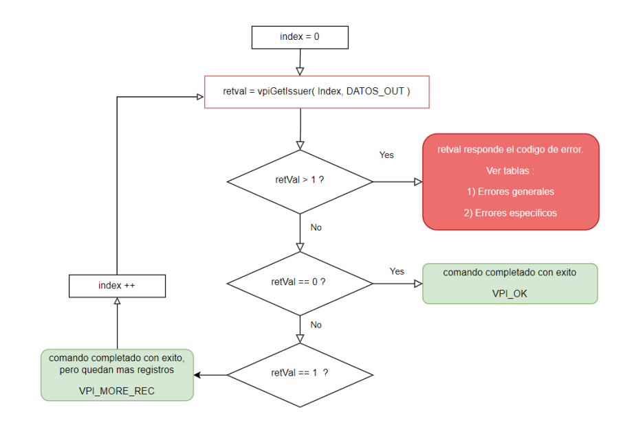

# Comandos indexados 
Estos son comandos en que se solicita la información de un determinado registro (indice).

En la estructura de salida, según sea el caso, va a estar la información de dicho registro. El indice inicial es **0**, y el indice final está determinado por el valor de retorno del método.
````c
VPI_OK:         Fin de registros.
VPI_MORE_REC:   Quedan registros por consultar.
````
En el siguiente diagrama de flujos ejemplificamos como sería el caso del método consulta de tarjetas (vpiGetIssuer):



Siendo esto replicable a los demás métodos indexados.

Los métodos que comparten esta esquema son:
````c
Consulta de último cierre:
Int vpiGetBatchCloseData(WORD index, vpiBatchCloseDataOut_t * output)
Consulta de tarjetas:
Int vpiGetIssuer(WORD index, vpiIssuerOut_t* output)
Consulta de planes:
Int vpiGetPlan(WORD index, vpiPlanOut_t* output)
````
---
#### Otros enlaces
- [Principal](../README.md).
- [Manejo de puertos](../Funcionalidades/Puertos.md)
- [Prueba de comunicación](../Funcionalidades/ComTest.md)
- [Venta](../Funcionalidades/Venta.md).
- [Venta + Extracción](../Funcionalidades/Venta+Extracción.md).
- [Venta con QR](../Funcionalidades/VentaQR.md) + pago con transferencias.
- [Anulación](../Funcionalidades/Anulacion.md)
- [Cierre de lote](../Funcionalidades/cierreLote.md).
- [Devolución](../Funcionalidades/Devolucion.md).
- [Consulta de último cierre de lote](../Funcionalidades/consultaCierre.md).
- [Consulta de última transacción](../Funcionalidades/consultaUltTransaccion.md).
- [Consulta de tarjetas](../Funcionalidades/consultaTarjetas.md) disponibles para operar.
- [Consulta de planes](../Funcionalidades/consultaPlanes.md) a aplicar por tarjeta.